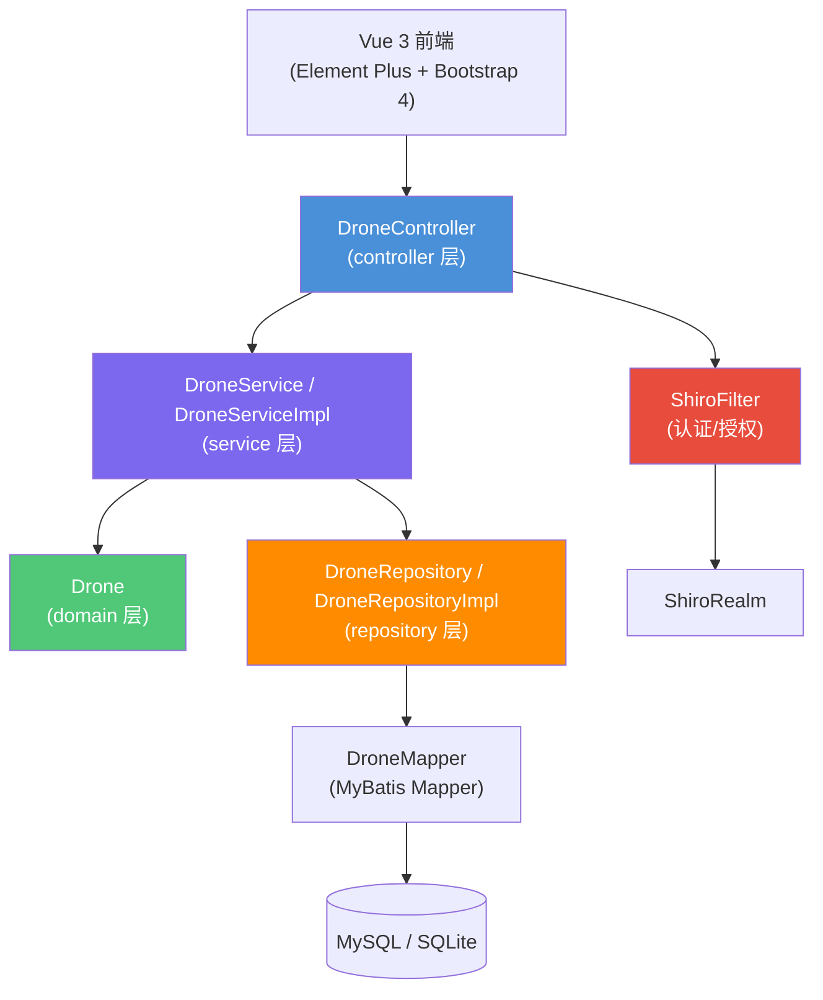

# 无人机信息管理 技术设计文档

**关联需求**：[无人机管理需求](../01-product-specs/drone-management-spec.md)
**文档状态**：已确认
**创建时间**：2026-05-29
**最后更新**：2026-05-29
**负责人**：@dev

---

## 概述

基于 Spring Boot 2.2.x + Vue 3 + MyBatis 3.5.x 实现无人机信息管理系统，采用标准四层架构（Controller → Service → Repository → Domain），前后端通过 REST API 进行数据交换。使用 Apache Shiro 进行认证授权，支持 MySQL/SQLite 双数据库切换。

---

## 架构设计

### 组件关系图



### 数据流向

**请求处理流程**：

1. 客户端发送 HTTP 请求 → Shiro 过滤器认证
2. Controller 接收参数，@Valid 触发校验
3. Controller 将 DroneUpsertRequest DTO 传递给 DroneService
4. Service 执行业务逻辑（fillByAiStrategy 补齐缺失字段）
5. Service 调用 DroneRepository → DroneMapper（MyBatis XML）
6. MyBatis 执行 SQL 与数据库交互
7. 结果封装为 ApiResponse 统一格式返回

**异常处理流程**：

1. Service 或 Repository 抛出 BusinessException
2. GlobalExceptionHandler (@RestControllerAdvice) 捕获
3. 返回 HTTP 400 + ApiResponse.fail(message)

---

## 接口定义

### REST API

**基础路径**：`/api/drones`

| 方法 | 路径 | 描述 | 认证 | 请求体 | 响应体 |
|------|------|------|------|--------|--------|
| GET | `/api/drones` | 查询全部无人机 | 开发阶段放行 | — | `ApiResponse<List<Drone>>` |
| GET | `/api/drones/{id}` | 根据 ID 查询 | 开发阶段放行 | — | `ApiResponse<Drone>` |
| POST | `/api/drones` | 新增无人机 | 开发阶段放行 | `DroneUpsertRequest` | `ApiResponse<Drone>` |
| PUT | `/api/drones/{id}` | 更新无人机 | 开发阶段放行 | `DroneUpsertRequest` | `ApiResponse<Drone>` |
| DELETE | `/api/drones/{id}` | 删除无人机 | 开发阶段放行 | — | `ApiResponse<Void>` |

#### 接口详情：GET /api/drones

**响应示例（200 OK）**：

```json
{
  "success": true,
  "message": "OK",
  "data": [
    {
      "id": 1,
      "serialNumber": "SN-1704067200000",
      "model": "Mavic-Air",
      "batteryPercent": 85,
      "maxFlightMinutes": 35,
      "status": "IDLE"
    }
  ]
}
```

#### 接口详情：POST /api/drones

**请求体**：

```json
{
  "serialNumber": "SN-1704067200000",
  "model": "Mavic-Air",
  "batteryPercent": 85,
  "maxFlightMinutes": 35,
  "status": "IDLE"
}
```

**请求体字段说明**：

| 字段名 | 类型 | 必填 | 校验规则 | 描述 |
|--------|------|------|----------|------|
| serialNumber | String | 否 | 长度 ≤ 64，留空自动生成 | 无人机序列号 |
| model | String | 否 | 长度 ≤ 64，留空随机选取 | 无人机型号 |
| batteryPercent | Integer | 否 | 0-100，留空随机生成 60-100 | 电池百分比 |
| maxFlightMinutes | Integer | 否 | 1-300，留空随机生成 20-50 | 最大飞行时长 |
| status | String | 否 | 长度 ≤ 32，留空随机选取 | 状态：IDLE/CHARGING/IN_MAINTENANCE |

---

## 数据模型

### 实体类

**`Drone` 实体类**（对应表：`drone`）：

| 字段名 | Java 类型 | 数据库类型 | 约束 | 说明 |
|--------|-----------|-----------|------|------|
| id | Long | BIGINT | PK | 主键（由后端计算 MAX(id)+1） |
| serialNumber | String | VARCHAR(64) | NULL | 序列号 |
| model | String | VARCHAR(64) | NULL | 型号 |
| batteryPercent | Integer | INT | NULL | 电量 0-100 |
| maxFlightMinutes | Integer | INT | NULL | 最大飞行时长 |
| status | String | VARCHAR(32) | NULL | 状态 |

### 请求 DTO

**`DroneUpsertRequest`**：

| 字段名 | Java 类型 | 校验注解 | 说明 |
|--------|-----------|---------|------|
| serialNumber | String | `@Size(max=64)` | 序列号（可选） |
| model | String | `@Size(max=64)` | 型号（可选） |
| batteryPercent | Integer | `@Min(0) @Max(100)` | 电量（可选） |
| maxFlightMinutes | Integer | `@Min(1) @Max(300)` | 飞行时长（可选） |
| status | String | `@Size(max=32)` | 状态（可选） |

### 数据库表结构

```sql
CREATE TABLE drone (
    id                  BIGINT      NOT NULL COMMENT '主键（非自增，后端计算）',
    serial_number       VARCHAR(64)          COMMENT '序列号',
    model               VARCHAR(64)          COMMENT '型号',
    battery_percent     INT                  COMMENT '电池百分比 0-100',
    max_flight_minutes  INT                  COMMENT '最大飞行时长（分钟）',
    status              VARCHAR(32)          COMMENT '状态：IDLE/CHARGING/IN_MAINTENANCE',
    PRIMARY KEY (id)
);
```

---

## 技术选型

| 技术 | 版本 | 用途 | 选择理由 |
|------|------|------|----------|
| Spring Boot | 2.2.13 | 应用框架 | drone.txt 指定版本 |
| Spring Framework | 5.2.x | IoC/AOP | Spring Boot 2.2.x 内置 |
| MyBatis | 3.5.16 | ORM | drone.txt 指定，接口+XML 映射 |
| MyBatis Spring Boot | 2.1.4 | MyBatis 自动配置 | 与 Spring Boot 2.2.x 兼容 |
| Apache Shiro | 1.7.1 | 安全认证 | drone.txt 指定 |
| Alibaba Druid | 1.2.24 | 数据库连接池 | drone.txt 指定，监控能力 |
| Hibernate Validator | 6.0.x | 参数校验 | Spring Boot 2.2.x 内置 |
| Vue | 3.5.13 | 前端框架 | drone.txt 指定 |
| Element Plus | 2.9.1 | Vue3 UI 组件库 | 提供 el-table/el-form 等组件 |
| Bootstrap | 4.6.2 | CSS 样式框架 | drone.txt 指定 |
| Vite | 6.0 | 前端构建工具 | Vue 3 官方推荐 |
| Axios | 1.7 | HTTP 客户端 | 前端 API 请求 |
| MySQL | 8.0 | 主数据库 | drone.txt 指定 |
| SQLite | 3.x | 文件数据库 | drone.txt 指定，轻量备选 |

---

## 风险与注意事项

### 技术风险

| 风险 | 影响程度 | 概率 | 应对策略 |
|------|----------|------|----------|
| Shiro 与 Spring Boot 2.2.x 兼容性问题 | 中 | 低 | 使用 shiro-spring-boot-starter 1.7.1 官方 starter |
| ID 手动管理导致并发冲突 | 高 | 中 | 删除+ID 重排加 @Transactional，后续可改为自增/雪花 ID |

### 注意事项

1. **ID 非自增设计**：由后端计算 MAX(id)+1，注意并发场景下的事务边界
2. **AI 策略当前为随机值**：fillByAiStrategy 使用随机数模拟，后续可接入真实 AI 接口
3. **事务安全**：deleteDrone 包含删除+ID 重排两步操作，使用 @Transactional 保证原子性
4. **Element Plus + Bootstrap 共存**：两者均为 UI 框架，Bootstrap 提供辅助栅格和工具类

---

## 测试策略

| 测试类型 | 测试类 | 测试框架 | 覆盖场景 |
|----------|--------|----------|----------|
| Service 单元测试 | `DroneServiceImplTest` | Mockito | CRUD 正常流程、异常场景（ID 不存在） |
| Controller 切片测试 | `DroneControllerTest` | @WebMvcTest | API 参数校验、响应格式、HTTP 状态码 |
| 集成测试 | — | @SpringBootTest | 端到端数据库操作（后续补充） |

---

## 变更记录

| 版本 | 日期 | 变更内容 | 变更人 |
|------|------|----------|--------|
| v1.0 | 2026-05-29 | 初始版本 | @dev |
